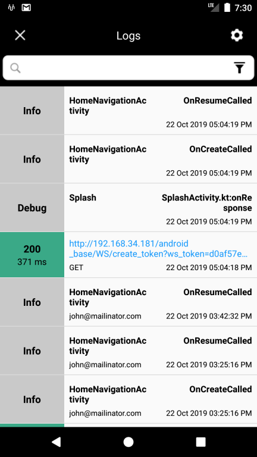
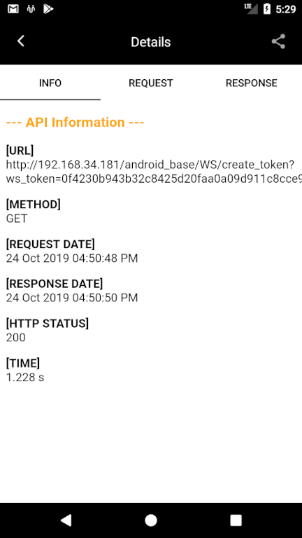
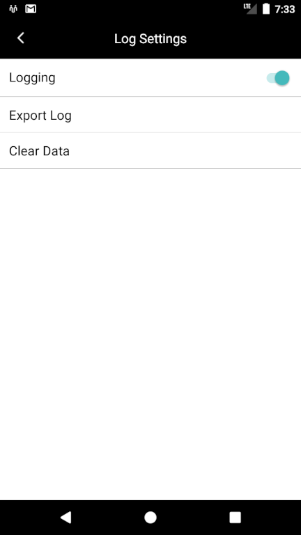

# Logger <br />
**android logging library**

*Description*
Logger is a library to dump log from an android app so developers can easily troubleshoot issues which are faced by end users.
It gives a simple minimalistic UI where users can see all logs within the app and can share separate / bulk logs
to the reported developer.
It covers all types of log including network (api calls, even crash). <br />






# Features
-Dump log category wise like info, warning, debug , crash, network <br />
-Developer doesn’t require more knowledge to dump the network or crash log just initialize the logger <br />
-Simple minimalistic ui to show all log with filter <br />
-Export all log at glance or seperate log sharing <br />

# Download
```groovy
implementation "com.hb.logger:logger:1.7"
```

and into RootProject > build.gradle
allprojects > repositories

```groovy
maven { url "https://dl.bintray.com/hbdevmdm/maven” }
```


Application Class
```kotlin
Logger.initializeSession(this)
```

Retrofit Api Client
Add logger interceptor to dump network events at your api client using below

```kotlin
addInterceptor(LoggerInterceptor())
```


# Documentation
*Static methods*

-**initializeSession(context)** - this will initialize logger library and will start reporting log into database <br />
-**resetSession()** - will clear current session and generate new session <br />
-**clearAllLogs()** - will clear all logs from database ( no revert for this action) <br />
-**disableLogger()** - to disable logger so it’ll not report new logs anymore. Old one stays as it is. <br />
-**enableLogger()** - to enable logger so it’ll start reporting new logs. (this will not generate new session previous session will continue) <br />
-**isEnableLogger()** - returns true if logger is enabled <br />
-**setUserInfo(name:String)** - to store user information with your custom log so you’ll easily reproduce issue or identify issue <br />
-**makeCrash()** - just for making crash to test logger crash event <br />
-**launchActivity()** - to open log list screen <br />

*General Methods*

-**debugEvent(tag: String , message: String)** - to dump debug event all event within this method will reported as DEBUG log <br />
-**warningEvent(tag: String , message: String)** - to dump warning event all event within this method will reported as WARNING log <br />
-**dumpCustomEvent(tag: String, eventDescription: String)** - to dump custom event all event within this method will reported as INFO log <br />
-**dumpCrashEvent(throwable: Throwable)** - to dump crash event ( note logger itself dump crash event if any crash found within the application) <br />
-**dumpNetworkEvent(networkParams...)** - to dump network event ( note logger itself dump api events which is made by retrofit and if you register addInterceptor(LoggerInteterceptor()) at retrofit api client creation)

# License

```
Copyright 2017 HiddenBrains

Licensed under the Apache License, Version 2.0 (the "License");
you may not use this file except in compliance with the License.
You may obtain a copy of the License at

   http://www.apache.org/licenses/LICENSE-2.0

Unless required by applicable law or agreed to in writing, software
distributed under the License is distributed on an "AS IS" BASIS,
WITHOUT WARRANTIES OR CONDITIONS OF ANY KIND, either express or implied.
See the License for the specific language governing permissions and
limitations under the License.